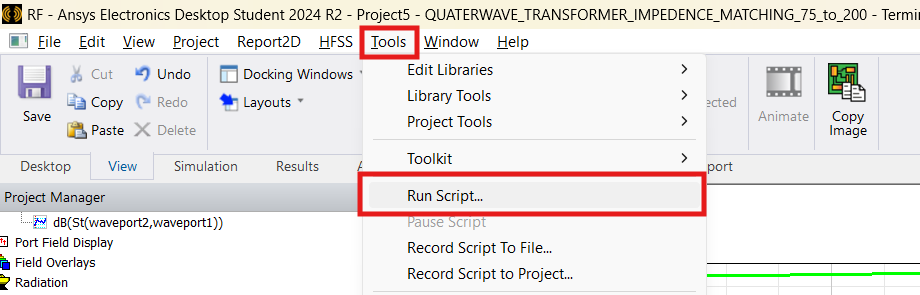
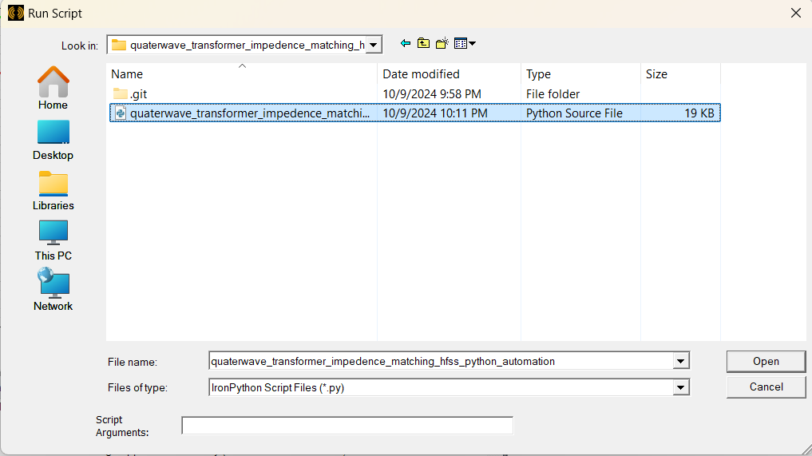
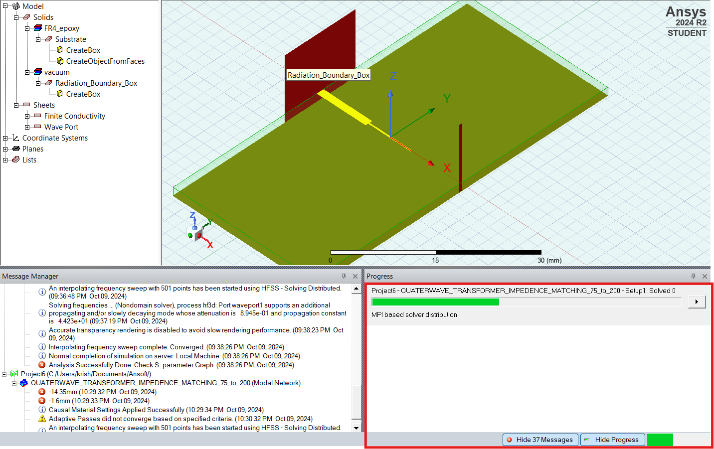
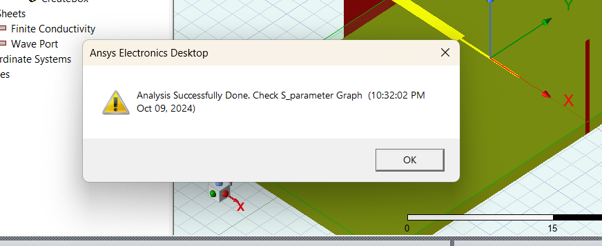
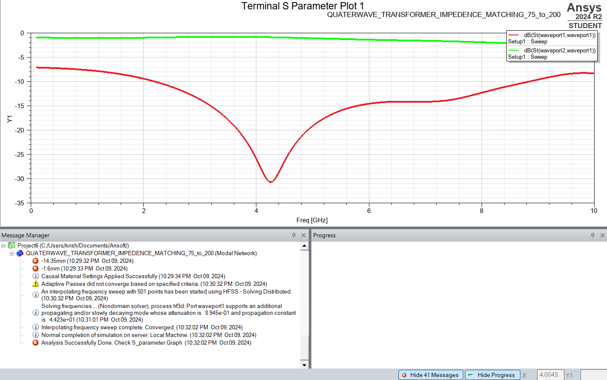

# Quaterwave Transformer for Impedence Matching in HFSS Using Python Script

## Code is Tried on Ansys Electronics Desktop Student 2024 R2

## Step 1. Change values as per your goals
```py
NEW_DESIGN_NAME = "QUATERWAVE_TRANSFORMER_IMPEDENCE_MATCHING_75_to_200" 

# PORT 1
PORT_1_IMPEDENCE = 75 #unit ohm (number)
PORT1_X_LENGTH = "10mm" 
PORT1_Y_WIDTH = "1.428mm"

# PORT 2
PORT_2_IMPEDENCE = 200 #unit ohm (number)
PORT2_X_LENGTH = "10mm"
PORT2_Y_WIDTH = "0.046mm"

# 1/4 Wave Transformer
TRANSFORMER_X_LENGTH = "8.7mm" #1/4 wavelength or 90degree
TRANSFORMER_Y_WIDTH = "0.380mm"

# SUBSTRATE Protperties
SUBSTRATE_Y_WIDTH = "60mm"
SUBSTRATE_Z_HEIGHT = "1.6mm"
SUBSTRATE_MATERIAL = "\"FR4_epoxy\""

### ANALYTICS VARIABLES ### 
FREQUENCY = 6 # (GHz)
MAXIMUM_PASSES = 6
# SWEEP - Enter Frequency Range (Ghz)
RANGE_START = 0.1 # (GHz)
RANGE_END = 10# (GHz)
POINTS = 501

# True if you want to Run Analysis and Generate S11 and S21 Plots
ANALYZE_ALL_AND_GENERATE_S_PLOT = True

```
## For Microstrip Line Width and Length Calculations You Can use [Abhi’s Lab: Microstrip Line Calculator](https://abhislab.in/abhis-lab-microstrip-line-calculator/) on my Blog or [Abhi's Lab: Microstrip Line Calculator-HTML and Python Version Project on Github](https://github.com/AbhayNathani/micro-stripline-calculator) from My Github Projects.


## Instructions for Updating values:
    1. Please Maintain units while changing parameters
    2. Prefer Using rounded values upto 2-3 decimals as code is parametric, due to long decimal values like "1.0256497877mm" it may create conflicts in Design Process. Try to make it "1.025mm"

## Step 2. Run The Script
### 1. Open Ansys Electronics Desktop
### 2. Click Tools > Run Script

### 3. Select Script File

### 4. Click Open and script will start its job.
---

---

---



## Feel Free to tinker with the code.
## [Checkout Abhi's Lab Blog For More Such Projects](https://abhislab.in/)